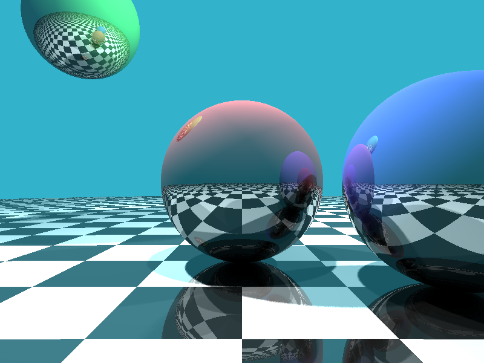

# Assembly Ray-Tracer
[](./LICENSE)

This project implements a simple ray-tracer in x86-64 assembly language using NASM (Netwide Assembler). The ray-tracer generates a BMP image file displaying two spheres.

## Sample



## Prerequisites

To compile and run this project, you'll need:

- NASM (Netwide Assembler)
- A Linux environment or Windows Subsystem for Linux (WSL)
- A linker (ld) and basic build tools

On Ubuntu or Debian-based systems, you can install the necessary tools with:

```bash
sudo apt update
sudo apt install nasm build-essential
```

## Compiling the Project

To compile the ray-tracer, follow these steps:

1. Clone this repository.
2. Open a terminal and navigate to the project directory.
3. Run the following commands:
    ```bash
    nasm -f elf64 main.asm
    ld main.o -o raytracer
    ```

This will create an executable named `raytracer`.

## Running the Ray-Tracer

To run the ray-tracer and generate the BMP image:

```bash
./raytracer > output.bmp
```

This command will create a file named `output.bmp` in the current directory.

## Viewing the Output

You can view the generated BMP file using any image viewer that supports the BMP format. On most systems, double-clicking the file should open it in the default image viewer.

If you're using WSL without GUI support, you may need to copy the file to your Windows file system to view it:

```bash
cp output.bmp /mnt/c/Users/YourWindowsUsername/Desktop/
```

Replace `YourWindowsUsername` with your actual Windows username.

## Project Structure

- `main.asm`: The main assembly source code for the ray-tracer.
- `README.md`: This file, containing project information and instructions.
- `.gitignore`: Specifies intentionally untracked files to ignore.

## Contributing

Contributions to improve the ray-tracer are welcome. Please feel free to submit pull requests or open issues to discuss potential changes or enhancements.

## License

MIT. See [LICENSE](LICENSE)

